# Sprint 1 - Nivel 1

## Exercici 1
Mostra les característiques principals de l'esquema creat i explica les diferents taules i variables que existeixen. Assegura't d'incloure un diagrama que il·lustri la relació entre les diferents taules i variables.

### Descripcion de la base de datos

El comando _**DESCRIBE**_ se usa para obtener información sobre la estructura de una tabla específica

   - _**DESCRIBE company**_ para obtener información sobre la estructura de la tabla llamada "company".
   - _**DESCRIBE transaction**_ para obtener información sobre la estructura de la tabla llamada "transaction".
   
Estos comandos proporcionan detalles sobre los campos de ambas tablas, los tipos de datos de los campos, las primary y foreing key. En el caso de la tabla company, dado que es una tabla de    dimensiones tenemos solo primary key. 

### Tabla de dimensiones y hechos

Esta base de datos consta de dos componentes principales:
1. Tabla de dimensiones: _**company**_
      
    Contiene 6 campos, todos ellos de tipo string.
    Funciona como una tabla de dimensiones, donde cada fila describe una compañía con información relacionada con contacto, teléfono, ubicación y sitio web.
   
3. Tabla de hechos: _**transaction**_
   
    Contiene 9 campos con formatos que incluyen interger, fechas y caracteres. Esta tabla registra informacion de tallada sonbre las transacciones realizadas.

### Relacion entre tablas

En la figura se muestra el diagrama de ambas tablas, en la que se observa la relacion de 1:n entre la tabla company y la tabla transaction. La prymary key es company.id
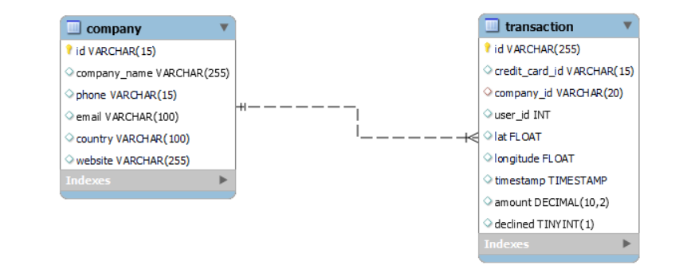
   

### Interpretación de la tabla

En el contexto de esta base de datos, la tabla "transaction" representa los eventos o acciones específicas que ocurren, mientras que la tabla "company" proporciona información estática sobre las compañías involucradas en estas transacciones.

Cada fila en la tabla "transaction" está asociada con un ID que corresponde a una transacción específica de una compañía específica, la cual está descrita en la tabla "company".

## Exercici 2

- He hecho las modificaciones y con eso he obtenido la tabla.
- Ahora se puede ver completo el pantallazo con el output de respuesta.

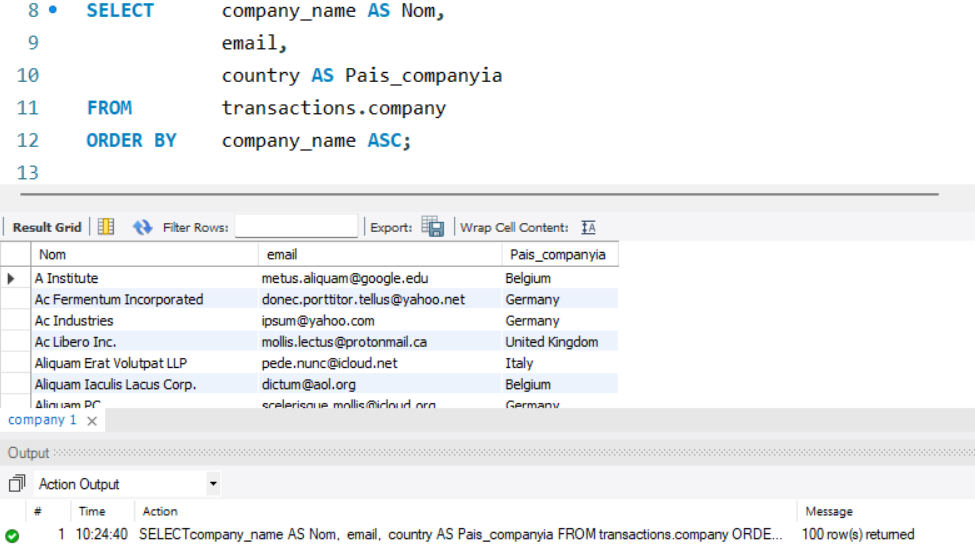

## Exercici 3

- He utilizado el ***select distinct*** y así he quitado la función agregada y el ***GROUP BY***.

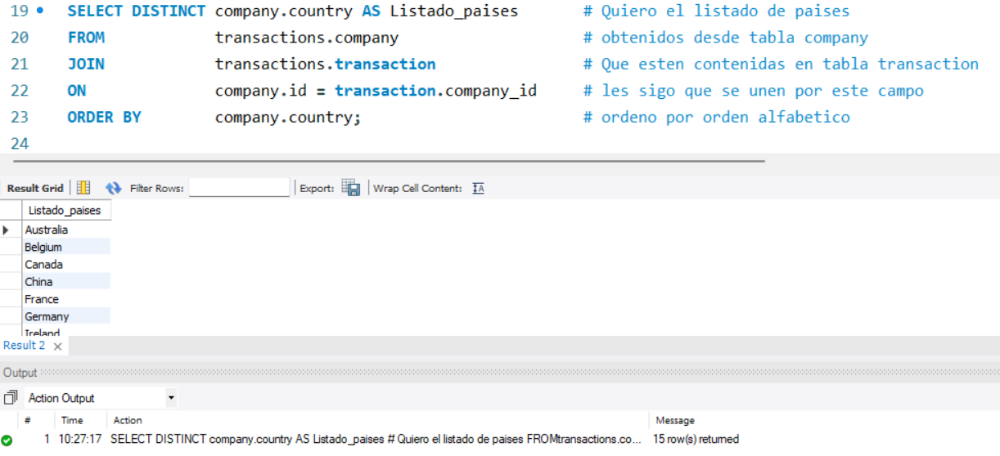

## Exercici 4

- He quitado la subquery y ha quedado de acuerdo a lo indicado en la corrección.
- He agregado todo el pantallazo para ver el result y el output.

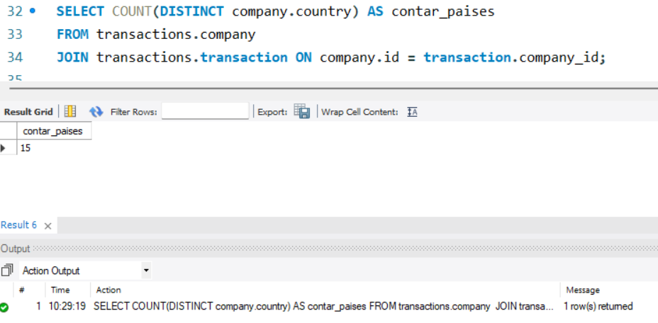

    
## Exercici 5

Para esto extraigo la informacion desde la tabla **company**, y a traves del comando _**WHERE**_ busco el id de la compañia. 

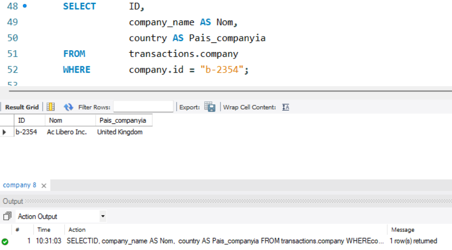

## Exercici 6

En este caso, considearamos que al solicitar la despesa mitjana se refiere a la despesa promedio. 

Por ello utilizo una funcion de promerido _**AVG**_. Como nos solicitan el la compañia con mayor despesa, puedo ordenarlos a traves de un _**order by**_ de mayor a menor (_**DESC**_) y obtener el _**LIMIT**_ 1.

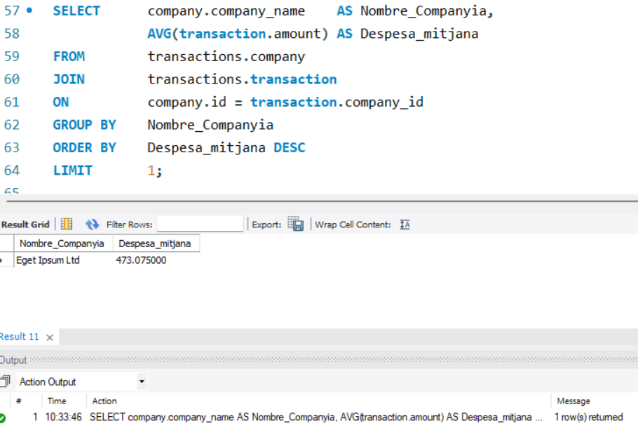

---

# Sprint 1 - Nivel 2

## Exercici 1

En este caso, debo generar un consulta en la tabla _**company**_ buscando duplicados. 

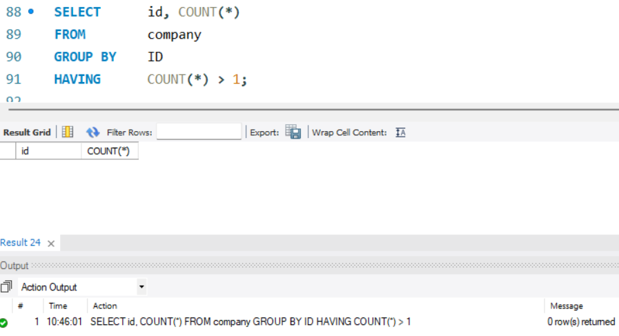

Utilizo el HAVING para identificar aquellos que tienen mas de 1 registro y con ello saber si hay duplicados.

Respuesta: No hay _**Id**_ s repetidos

## Exercici 2

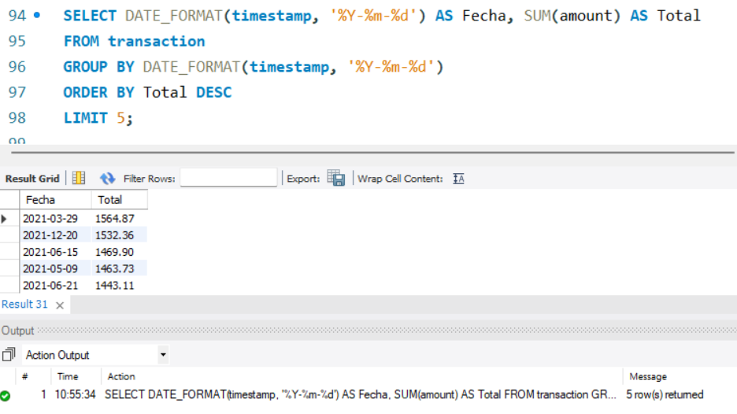

## Exercici 3

Me baso en el ejercico anterior para obtener las 5 transacciones mas bajas esto se obtiene mediante:

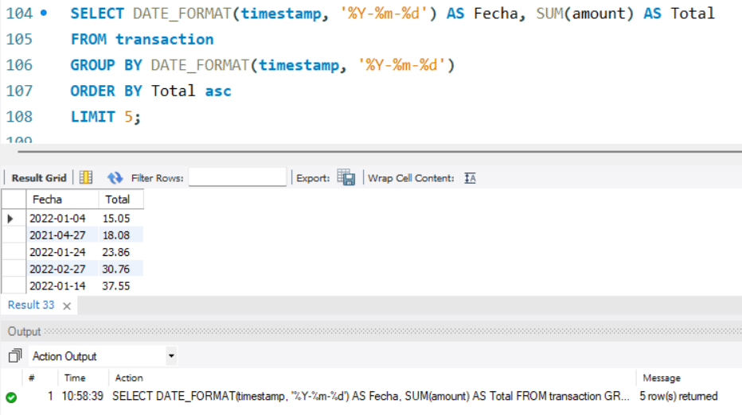

# Exercici 4

En este caso, mediante el comando _**ROUND**_ redondeo el numero a dos decimales para una mejor visualización. 

En el caso de _**order by**_ por defecto genera un orden de mayor a menor.

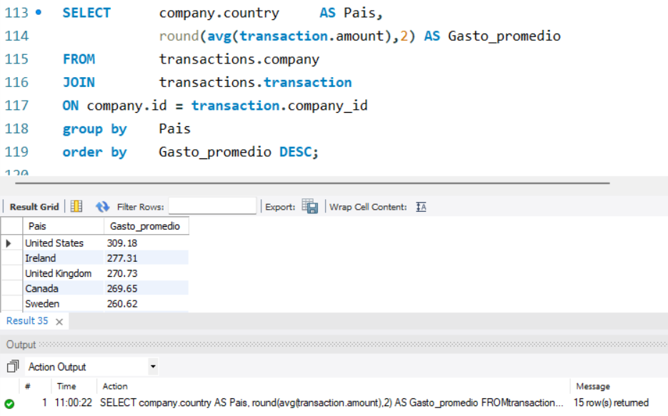

# Sprint 1 - Nivel 3
## Exercici 1

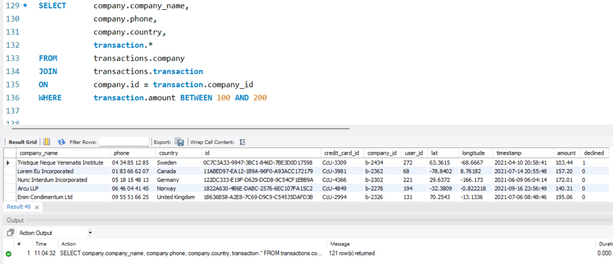

## Exercici 2

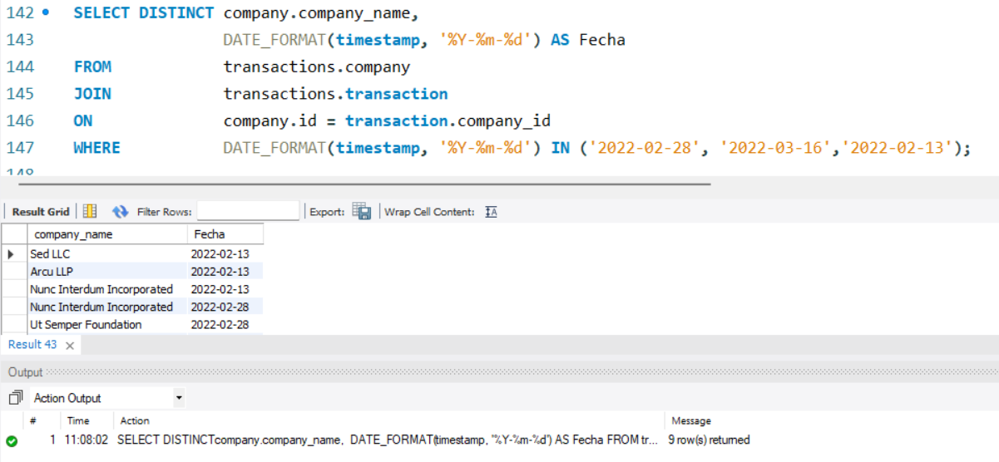

- El comando _**DISTINCT**_ es necesario para asegurar que cada nombre de compañía se muestre solo una vez en los resultados.
- Para seleccionar las fechas especificadas lo primero es transformarlas a un formato **'%Y-%m-%d**. Para lo anterior:
	- Para el cambio de formato utilizo el comando _**DATE_FORMAT**_,
 	- Para seleccionar las fechas utilizo el comando _**WHERE**_ con el operado _**IN**_ ('2022-02-28', '2022-03-16', '2022-02-13').

